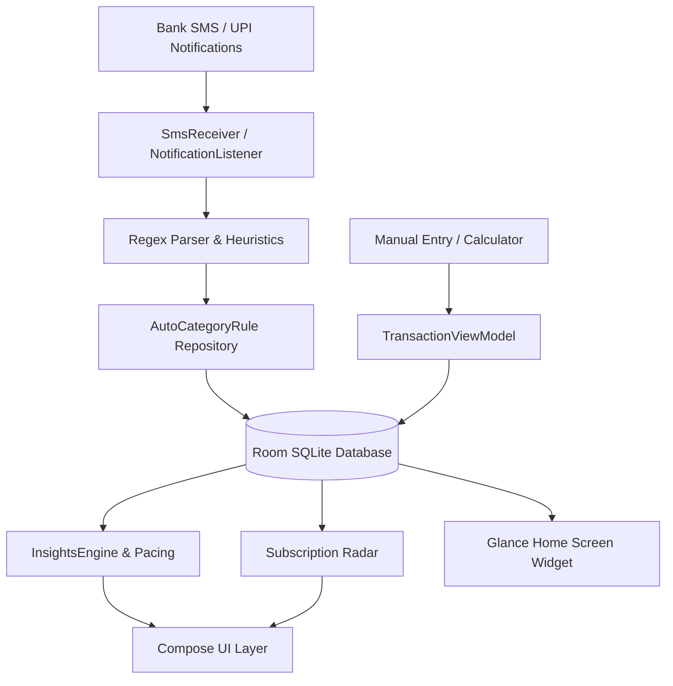

# SpendZen

SpendZen is a local-first, privacy-focused expense tracker for Android. It automates transaction capture from bank SMS and UPI notifications, maintains double-entry accounting with `BigDecimal` precision, and provides budget pacing and recurring bill tracking with zero network telemetry.

---

## Key Features

- **Automated Capture**: Ingests and parses bank debit/credit SMS alerts and UPI notifications in real time via regular expression heuristics.
- **Auto-Categorization Rules**: Matches vendor keywords to assign categories automatically without cloud dependencies.
- **Double-Entry Ledger**: Uses `java.math.BigDecimal` (`RoundingMode.HALF_UP`) for all currency operations across bank accounts, credit cards, cash wallets, and inter-account transfers.
- **Day-Grouped Transaction Feed**: Organizes entries by relative dates (Today, Yesterday, date) with day expense totals and custom tags (`#tag`).
- **Two-Tier Categories**: Organizes expenses across parent category rails and subcategory flow chips.
- **Budget Pacing & Radar**: Monitors monthly category limits and detects recurring bill cycles (subscriptions, rent, utilities).
- **In-App Calculator & Split Bill**: Supports arithmetic expressions directly within the amount field and split-bill calculation.
- **Local Backup & Restore**: Exports and imports atomic database snapshots in JSON format using Android Storage Access Framework (SAF).

---

## Architecture Overview



### Technology Stack

| Layer | Component | Details |
|---|---|---|
| **Language** | Kotlin 2.0+ | Coroutines, Flow, StateFlow |
| **UI** | Jetpack Compose | Material 3 design system, Navigation 3 |
| **Database** | Room SQLite 2.7+ | Custom type converters, non-destructive migrations |
| **Background Tasks** | WorkManager | Periodic budget evaluation, daily spend reminders |
| **Widgets** | Jetpack Glance | Native Compose home screen widget |
| **DI / Architecture** | Clean Architecture | Service Locator pattern, MVVM with Unidirectional Data Flow |

---

## Project Structure

```
SpendZen/
├── app/
│   ├── src/
│   │   ├── main/
│   │   │   ├── java/com/example/myexpenditureapp/
│   │   │   │   ├── data/             # Room DB, DAOs, Entities, Seeders, BackupManager
│   │   │   │   ├── domain/           # InsightsEngine, Domain Models, Repository Interfaces
│   │   │   │   ├── notifications/    # NotificationListener, NotificationHelper, Workers
│   │   │   │   ├── sms/              # SmsReceiver, Regex Parsers
│   │   │   │   ├── ui/               # Screens, ViewModels, Theme, Shared Components
│   │   │   │   └── widget/           # Glance App Widget
│   │   │   └── AndroidManifest.xml
│   │   └── test/                     # Unit test suites (45 tests)
├── docs/                             # Technical specifications & SDLC documents
│   ├── ARCHITECTURE.md               # Data flow, schema, and architectural patterns
│   ├── DEVELOPMENT_LIFECYCLE.md      # Development process, standards, and git flow
│   ├── DATA_SCHEMA_MIGRATIONS.md     # Entity diagrams and migration registry
│   ├── CONTRIBUTING.md               # Contribution and coding guidelines
│   └── SECURITY_PRIVACY.md           # Permission scopes and local-only threat model
├── build.gradle.kts
└── README.md
```

---

## Build & Test

### Requirements
- Android Studio Ladybug (2024.2.1) or newer
- JDK 17 or 21
- Android SDK API 35 (Compile), API 26+ (Minimum)

### Commands

Run unit tests:
```bash
./gradlew testDebugUnitTest
```

Build debug APK:
```bash
./gradlew assembleDebug
```

Build release APK:
```bash
./gradlew assembleRelease
```

---

## Documentation

Detailed technical specifications are available in the [`docs/`](docs/) directory:

- [System Architecture](docs/ARCHITECTURE.md)
- [Development Lifecycle & Standards](docs/DEVELOPMENT_LIFECYCLE.md)
- [Database Schema & Migrations](docs/DATA_SCHEMA_MIGRATIONS.md)
- [Contributing Guidelines](docs/CONTRIBUTING.md)
- [Security & Privacy Model](docs/SECURITY_PRIVACY.md)

---

## License

This project is licensed under the [MIT License](LICENSE).
# SpendZen
