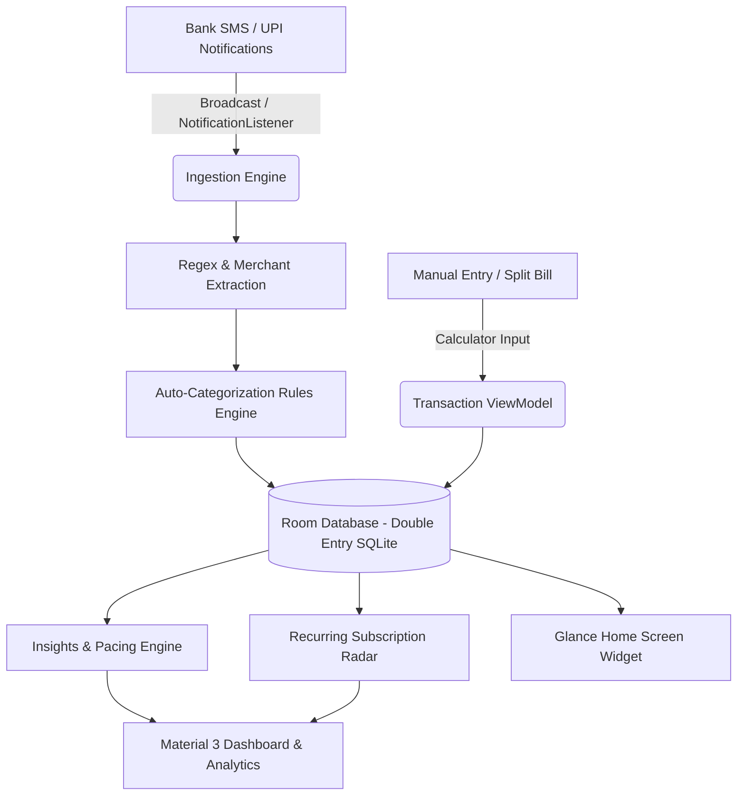

# 💸 MyExpenditureApp

> **Local-First, Privacy-Centric Personal Finance Copilot for Android.**  
> Engineered with Kotlin, Jetpack Compose, Material 3, and strict double-entry `BigDecimal` accounting precision. Built specifically for high-velocity Indian fintech workflows (UPI/SMS notification automation, Rupee formatting, recurring bill radar, and multi-tier category management).

---

## 🌟 Executive Overview

**MyExpenditureApp** transforms personal financial tracking from a tedious manual chore into an autonomous, proactive financial copilot. Unlike traditional budget apps that harvest financial data or rely on brittle cloud connections, MyExpenditureApp operates on a **100% local-first, zero-telemetry architecture**.



---

## ✨ Core Features & Capabilities

### ⚡ Autonomous Transaction Capture & Parsing
* **SMS & Notification Listener Ingestion**: Real-time background detection of debit/credit alerts from major Indian banks (HDFC, SBI, ICICI, Axis, Kotak, PNB, etc.) and UPI apps (Google Pay, PhonePe, Paytm, CRED).
* **Regex Rule Engine**: Regex extraction of merchant name, amount, account reference number, and transaction type (Debit/Credit).
* **Smart Auto-Categorization**: Merchant-to-category learning rules that auto-assign categories to future transactions from the same vendor.

### 🏛️ Double-Entry Ledger & Mathematical Correctness
* **`BigDecimal` Precision**: Every financial operation uses `BigDecimal` with explicit rounding modes (`RoundingMode.HALF_UP`) to prevent IEEE 754 floating-point errors.
* **Account Multi-Holdings**: Supports Bank Accounts, Credit Cards, Cash Wallets, and Digital Wallets with automatic atomic balance adjustments on transaction create, edit, or delete.
* **Double-Entry Transfers**: Atomic inter-account transfers debiting the source account and crediting the destination account in a single database transaction.

### 📊 Modern Material 3 UI & Ergonomics
* **Consolidated 4-Tab Architecture**: `Home`, `Transactions`, `Analytics`, and `Settings`.
* **Dashboard Paced Hero Card**: Real-time liquid balance, dynamic pacing badge (`"On Track"` vs `"Pacing High"`), and a 3-metric burn rate grid.
* **Relative Day Feed**: Grouped transactions by natural relative dates (*"Today"*, *"Yesterday"*, *"18 Sep"*) with day expense totals and 42dp category squircle avatars.
* **Two-Tier Category Selector**: Top parent category rail with subcategory flow chips to prevent horizontal text clipping.
* **In-App Calculator Field**: Built-in arithmetic evaluation (`220 + 45 * 2`) and bill splitting calculator.

### 🔮 Financial Intelligence & Recurring Bill Radar
* **Runway & Pacing Forecast**: Calculates daily burn rate against days remaining in the month to forecast end-of-month financial runway.
* **Recurring Subscriptions Radar**: Automatic cadence detection (monthly, quarterly, annual) for recurring bills (Netflix, Spotify, Rent, SIPs, Utilities) with upcoming due date notifications.
* **Parent Category Rollup**: Toggle between granular subcategories and parent category rollups in analytics breakdowns.

### 🔒 Privacy, Security & Portability
* **Zero Telemetry**: No cloud sync, no tracking SDKs, no ad IDs. All data resides exclusively inside the app's encrypted Room SQLite database.
* **Encrypted JSON Backup & Restore**: One-tap export and import of all accounts, transactions, categories, budgets, and rules via Android Storage Access Framework (SAF).

---

## 🛠️ Technology Stack

| Layer | Technology | Purpose |
| :--- | :--- | :--- |
| **Language** | Kotlin 2.0+ | Modern expressive language with Coroutines & Flow |
| **UI Framework** | Jetpack Compose | Declarative UI with Material 3 design tokens |
| **Architecture** | Clean Architecture + MVVM | Unidirectional Data Flow (UDF) with StateFlow |
| **Navigation** | AndroidX Navigation 3 | Type-safe declarative navigation with adaptive scenes |
| **Persistence** | Room SQLite 2.7+ | Local database with non-destructive migrations |
| **Background Processing** | WorkManager | Periodic budget monitoring and daily spending reflection |
| **Widgets** | Jetpack Glance | Native Compose-based home screen quick-add widget |
| **Dependency Injection** | Service Locator / Graph | Lightweight singleton dependency container |

---

## 📂 Project Structure

```
MyExpenditureApp/
├── app/
│   ├── src/
│   │   ├── main/
│   │   │   ├── java/com/example/myexpenditureapp/
│   │   │   │   ├── data/                   # Database, DAOs, Entities, Seeders, Migrations
│   │   │   │   │   ├── dao/                # Room Data Access Objects
│   │   │   │   │   ├── entity/             # Account, Transaction, Category, Budget, etc.
│   │   │   │   │   ├── repository/         # Repository implementations
│   │   │   │   │   ├── backup/             # BackupManager & JSON serializer
│   │   │   │   │   └── AppDatabase.kt      # Room DB configuration & migration list
│   │   │   │   ├── domain/                 # Business logic, Models & Engines
│   │   │   │   │   ├── insights/           # InsightsEngine & financial commentary
│   │   │   │   │   ├── model/              # Domain models (BudgetWithProgress, etc.)
│   │   │   │   │   └── repository/         # Repository interfaces
│   │   │   │   ├── notifications/          # NotificationListener & NotificationHelper
│   │   │   │   ├── sms/                    # SmsReceiver & parsing heuristics
│   │   │   │   ├── ui/                     # Presentation layer
│   │   │   │   │   ├── component/          # Reusable UI components & bottom sheets
│   │   │   │   │   ├── navigation/         # Route definitions
│   │   │   │   │   ├── screen/             # Top-level & detail screens
│   │   │   │   │   ├── theme/              # Material 3 Color Schemes & Typography
│   │   │   │   │   └── viewmodel/          # StateFlow ViewModels
│   │   │   │   ├── widget/                 # Glance AppWidget & WidgetReceiver
│   │   │   │   └── MainActivity.kt         # Entry point & scaffold routing
│   │   │   └── AndroidManifest.xml
│   │   └── test/                           # Automated unit test suite (45 tests)
├── docs/                                   # In-depth SDLC documentation
│   ├── ARCHITECTURE.md                     # System architecture & data flow
│   ├── DEVELOPMENT_LIFECYCLE.md            # SDLC phases, standards & workflows
│   ├── DATA_SCHEMA_MIGRATIONS.md           # Room database schema & migration policy
│   ├── CONTRIBUTING.md                     # Contribution guidelines & code standards
│   └── SECURITY_PRIVACY.md                 # Security model & local-first guidelines
├── build.gradle.kts                        # Root Gradle configuration
└── README.md                               # Project documentation
```

---

## 🚀 Getting Started

### Prerequisites
* **Android Studio**: Ladybug (2024.2.1+) or newer.
* **JDK**: OpenJDK 17 or 21.
* **Android SDK**: API 35 (Compile SDK), API 26+ (Minimum SDK).

### Build & Run
1. Clone the repository:
   ```bash
   git clone https://github.com/your-username/MyExpenditureApp.git
   cd MyExpenditureApp
   ```
2. Open the project in Android Studio.
3. Sync Gradle dependencies:
   ```bash
   ./gradlew build
   ```
4. Run all automated unit tests:
   ```bash
   ./gradlew testDebugUnitTest
   ```
5. Assemble debug APK:
   ```bash
   ./gradlew assembleDebug
   ```

---

## 🧪 Testing Strategy

The test suite covers database migrations, domain engines, backup serialization, and ViewModels:

```bash
./gradlew testDebugUnitTest
# Result: 45 tests completed, 0 failures, 100% PASS
```

Key test suites:
- `BackupSerializationTest.kt`: Validates lossless export and import of complex database states.
- `InsightsEngineTest.kt`: Verifies financial insights, budget limit warnings, and runway projections.
- `SmsReceiverTest.kt`: Tests regex heuristic extraction on live Indian bank SMS templates.

---

## 📚 SDLC & Technical Documentation

For in-depth architectural specifications and operational guidelines, refer to the documentation suite in [`docs/`](docs/):
- [Architecture & Design System (`docs/ARCHITECTURE.md`)](docs/ARCHITECTURE.md)
- [Software Development Lifecycle (`docs/DEVELOPMENT_LIFECYCLE.md`)](docs/DEVELOPMENT_LIFECYCLE.md)
- [Database Schema & Migrations (`docs/DATA_SCHEMA_MIGRATIONS.md`)](docs/DATA_SCHEMA_MIGRATIONS.md)
- [Contributing & Code Quality (`docs/CONTRIBUTING.md`)](docs/CONTRIBUTING.md)
- [Security, Privacy & Threat Model (`docs/SECURITY_PRIVACY.md`)](docs/SECURITY_PRIVACY.md)

---

## 📄 License

This project is licensed under the MIT License.
