# SpendZen (MyExpenditureApp)

> **Local-First, Privacy-Preserving Intelligent Android Expenditure Tracker**  
> Automated bank SMS & UPI parsing, double-entry accounting precision with `BigDecimal`, hardware-accelerated AI mascot companion, micro-expenditure leak radar, and zero network telemetry.

---

## 📱 Google Play Store Showcase

| 1. Financial Command Center | 2. Instant Auto-Payment | 3. Deep Spend Analytics | 4. Meet Nomi: AI Guardian |
| :---: | :---: | :---: | :---: |
| 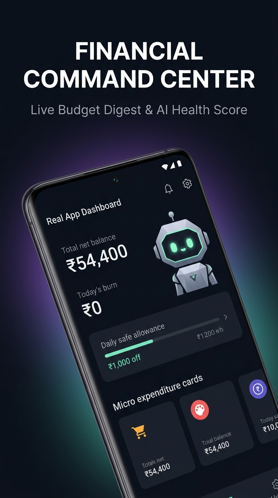 | 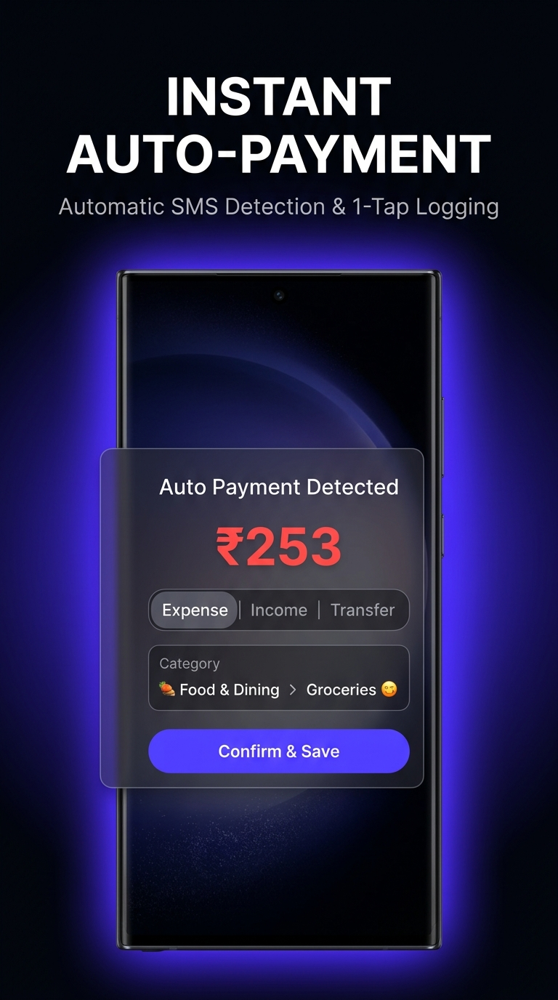 | 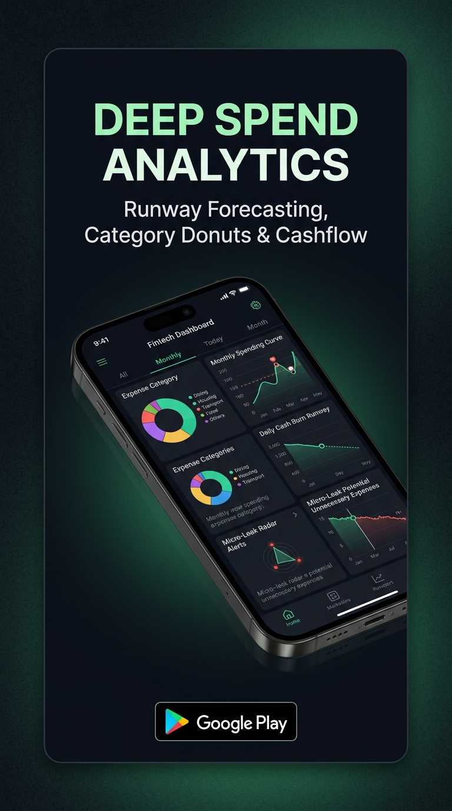 |  |
| *Live Budget Digest, Health Score & Safe Burn* | *Real-Time SMS Detection & 1-Tap Logging* | *Runway Forecasting & Micro-Leak Radar* | *Zero-Bloat Hardware-Accelerated Mascot* |

---

## 🤖 Meet "Nomi" — The Minimal Geometric Mascot

Inspired by **Teenage Engineering**, **Grok Bot**, and **Nothing OS**, **Nomi** is SpendZen's discreet financial companion:

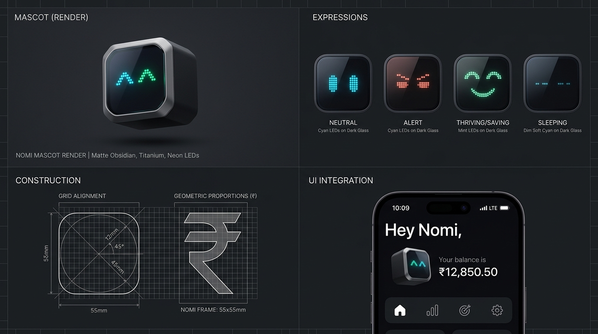

### Why Nomi Adds Zero Overhead:
- **0 KB Asset Weight**: Rendered 100% via Jetpack Compose `Canvas` with pure math and geometry.
- **Hardware-Accelerated (120 FPS)**: Executes directly on Android's GPU shader pipeline with near-zero CPU/RAM impact.
- **Dynamic Emotional States**:
  - `OPTIMAL (^ ^)`: Mint-green arcs when daily burn is under baseline.
  - `ALERT (\ /)`: Coral-red vigilant slits when a spending leak or budget breach occurs.
  - `NEUTRAL (| |)`: Calm cyan LED capsules that naturally blink every few seconds.
  - `SCANNING (—·—)`: Horizontal laser beam during SMS detection or payment parsing.
  - `SLEEPING (- -)`: Dim resting dashes for empty states and late-night idle periods.
- **Interactive Awakening Sequence**: Tapping Nomi launches a choreographed boot sequence (spring-damping scale, CRT visor expansion, radar sweep, eye glance, and wink) before settling back into the live floating mascot state with real-time financial diagnostics.

---

## 📸 App Screens Gallery

| 01. Dashboard | 02. Nomi Companion | 03. Analytics & Runway |
| :---: | :---: | :---: |
| 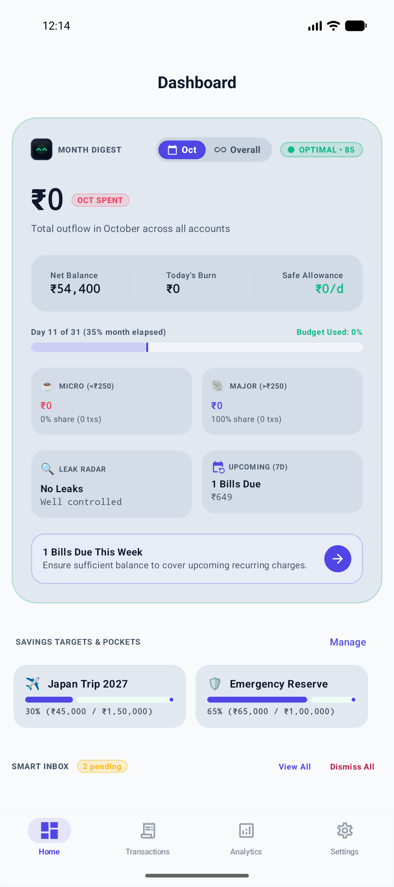 | 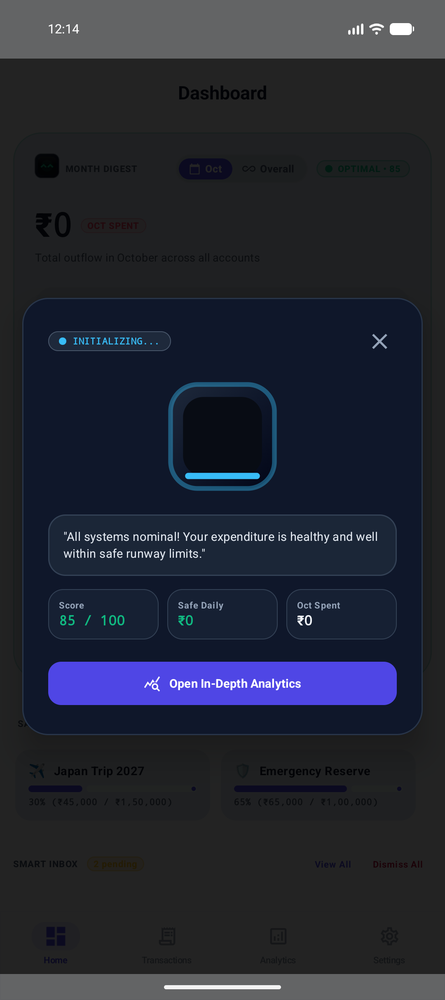 |  |

| 04. Transactions Feed | 05. Add / Edit Transaction | 06. Category & Subcategories | 07. Auto Payment Overlay |
| :---: | :---: | :---: | :---: |
| 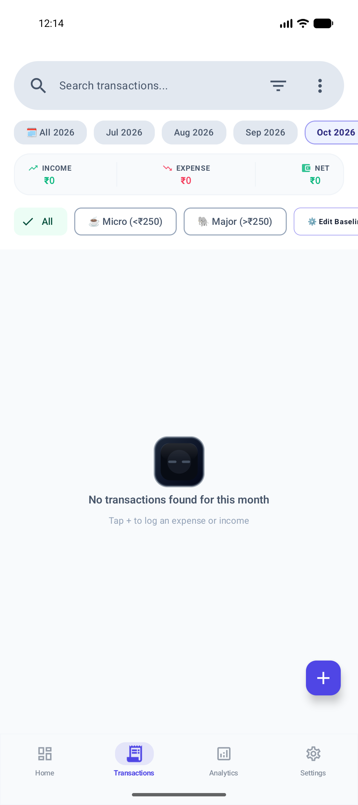 | 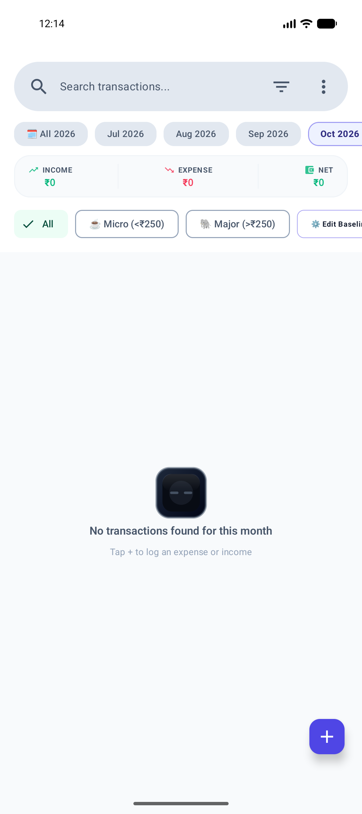 | 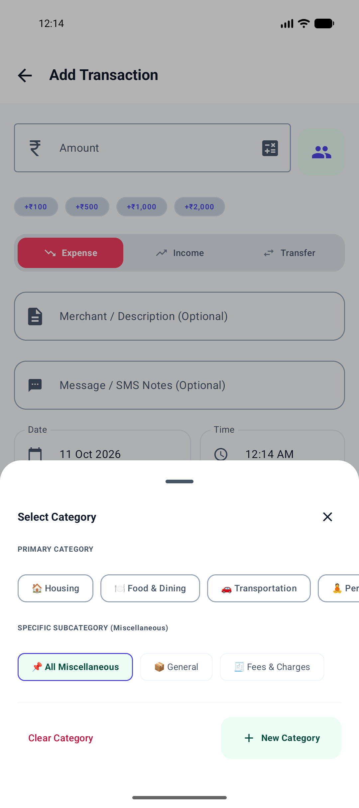 | 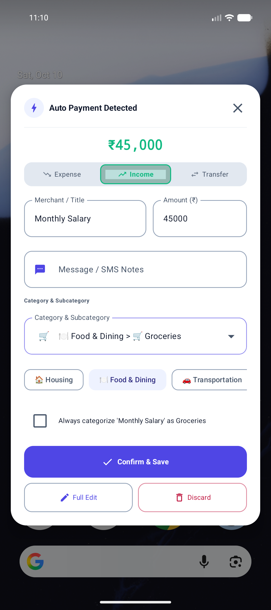 |

---

## ✨ Core Features & Functionality

### 1. Smart Finance Command Center & Digest
- **Financial Health Score (0–100)**: Evaluates runway, burn pace, and savings ratios.
- **Safe Daily Allowance**: Calculates how much you can safely spend today based on remaining days and monthly targets.
- **Today's Burn vs. Baseline**: Highlights anomalies in daily outflow.
- **Micro vs. Major Expenditure Split**: Distinguishes between routine micro-spends (< ₹250) and major capital expenditures (> ₹250).

### 2. Automated Capture & Instant Payment Overlay
- **Real-Time SMS & Notification Parsing**: Ingests bank alerts (SBI, HDFC, ICICI, Axis, Canara, etc.) and UPI apps (Google Pay, PhonePe, Paytm, CRED).
- **Floating Translucent Overlay (`TransactionOverlayActivity`)**:
  - Pops up immediately when a payment is detected.
  - Clean segmented control `[ Expense | Income | Transfer ]` in modern pill capsule styling.
  - Pre-fills merchant title, amount, and parsed SMS notes.
  - One-tap category selection and *"Always categorize vendor"* automated rules.

### 3. Two-Tier Hierarchical Categories & Subcategories
- Full two-tier hierarchy across parents and subcategories (e.g. `🍽️ Food & Dining > 🛒 Groceries`, `☕ Cafes`, `🍔 Restaurants`).
- Quick-select category suggestion chips.
- Modal bottom sheet with clean search and custom category creation.

### 4. Deep Spend Analytics & Micro-Leak Radar
- **Monthly Spending Curves & Trendlines**.
- **Category Donut Breakdowns** with percentage allocations.
- **Runway Estimator**: Months of runway left based on current liquid reserves and monthly expenditure velocity.
- **Leak Radar**: Identifies micro-spending spikes and recurring impulse patterns.

### 5. Multi-Account Accounting Ledger
- Double-entry accounting precision using `java.math.BigDecimal` (`RoundingMode.HALF_UP`).
- Supports Bank Accounts, Credit Cards, Cash Wallets, and Inter-Account Transfers.
- Tracks liquid reserves separately from locked savings targets.

### 6. Savings Targets & Reserve Pockets
- Define custom financial milestones (e.g., Japan Trip 2027, Emergency Fund).
- Real-time progress bars and automated deposit pacing.

### 7. Subscriptions & Upcoming Bills Radar
- Auto-detects recurring merchant charges (Netflix, Spotify, broadband, rent, utilities).
- Calendar countdown showing bills due within 7 days.

### 8. Android Home Screen Glance Widget
- Native Jetpack Glance widget (`ExpenditureWidget`) for instant balance, month burn, and 1-tap quick logging directly from your home screen.

---

## 🛠️ Architecture & Tech Stack

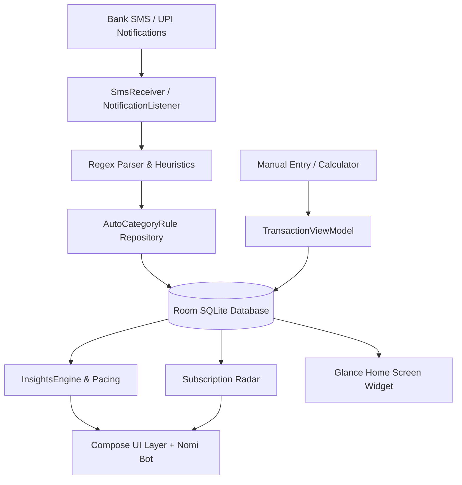
```mermaid
graph TD
    A[Bank SMS / UPI Notifications] --> B[SmsReceiver / NotificationListener]
    C[Manual Entry / Calculator] --> D[TransactionViewModel]
    B --> E[Regex Parser & Heuristics]
    E --> F[AutoCategoryRule Repository]
    F --> G[(Room SQLite Database)]
    D --> G
    G --> H[InsightsEngine & Pacing]
    G --> I[Subscription Radar]
    H --> J[Compose UI Layer + Nomi Bot]
    I --> J
    G --> K[Glance Home Screen Widget]
```

| Layer | Technology | Details |
| :--- | :--- | :--- |
| **Language** | Kotlin 2.0+ | Coroutines, Flow, StateFlow |
| **UI Framework** | Jetpack Compose | Material 3, Navigation 3 Backstack, Page Route Transitions |
| **Character & Mascot** | Pure Compose `Canvas` | Hardware-accelerated GPU shaders, 0 KB image bloat |
| **Database** | Room SQLite 2.7+ | Custom TypeConverters for `BigDecimal`, automated migrations |
| **Background Processing**| Android WorkManager | Periodic budget evaluation, scheduled health recalculations |
| **Widgets** | Jetpack Glance | Responsive home screen widget with atomic data updates |
| **Design Language** | Obsidian Minimalist | Dark space (#0B1019), Electric Indigo (#4F46E5), Mint Green (#10B981) |

---

## 📁 Project Structure

```
MyExpenditureApp/
├── app/src/main/
│   ├── java/com/example/myexpenditureapp/
│   │   ├── data/                 # Room Database, DAOs, Entities, Seeders, BackupManager
│   │   ├── domain/               # SmartDigestModel, InsightsEngine, Domain Models
│   │   ├── notifications/        # NotificationListener, NotificationHelper, Workers
│   │   ├── overlay/              # TransactionOverlayActivity (Instant SMS payment dialog)
│   │   ├── sms/                  # SmsReceiver, Regex Parsers
│   │   ├── ui/
│   │   │   ├── component/        # GeometricMascotBot, NomiCompanionOverlay, CategorySelectionBottomSheet
│   │   │   ├── screen/           # AccountScreens, AnalyticsScreens, TransactionScreens, BudgetScreens
│   │   │   ├── theme/            # Obsidian color palette, typography, shapes
│   │   │   └── viewmodel/        # TransactionViewModel, BudgetViewModel, AnalyticsViewModel
│   │   └── widget/               # ExpenditureWidget (Jetpack Glance)
│   ├── res/                      # XML resources, drawables, app icons
│   └── AndroidManifest.xml
├── docs/
│   ├── play_store/               # High-resolution Google Play Store showcase screenshot cards
│   ├── screenshots/              # Real application screenshots
│   ├── assets/                   # Nomi mascot brand system & identity board
│   ├── ARCHITECTURE.md           # Deep dive architectural documentation
│   └── SECURITY_PRIVACY.md       # Local-only privacy guarantee & permissions model
├── build.gradle.kts
└── README.md
```

---

## 🚀 Build & Run

### Prerequisites
- **Android Studio Ladybug (2024.2.1)** or newer
- **JDK 17** or **JDK 21**
- **Android SDK API 35** (Compile), **API 26+** (Minimum)

### Commands

Run unit tests:
```bash
./gradlew testDebugUnitTest
```

Build debug APK:
```bash
./gradlew assembleDebug
```

Install directly onto connected device / emulator:
```bash
adb install -r app/build/outputs/apk/debug/app-debug.apk
```

---

## 🔒 Privacy Guarantee

SpendZen is **strictly local-first**:
* **No network permissions** requested in `AndroidManifest.xml` (`android.permission.INTERNET` is omitted).
* **SMS & notifications** are parsed on-device in memory and never leave your hardware.
* **Database backups** are stored locally via Android Storage Access Framework (SAF).

---

## 📄 License

This project is licensed under the [MIT License](LICENSE).
