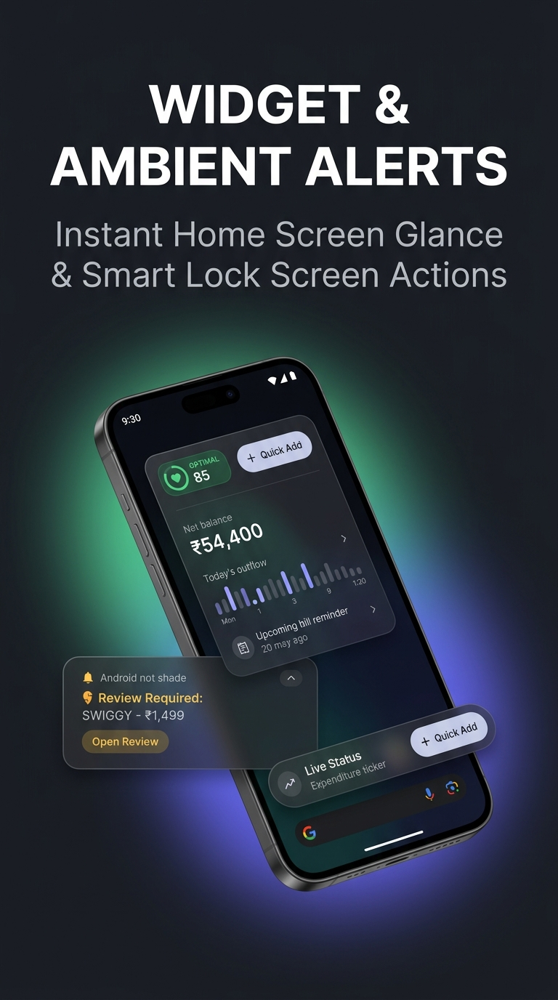
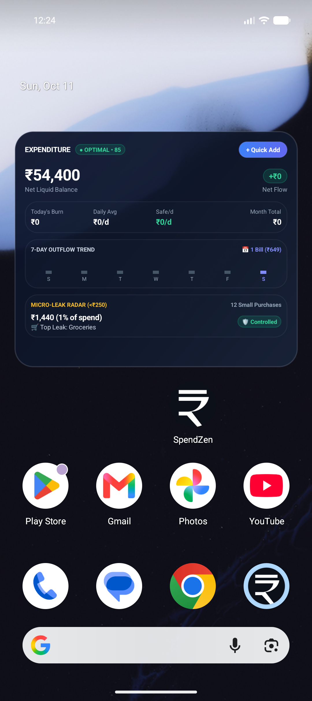
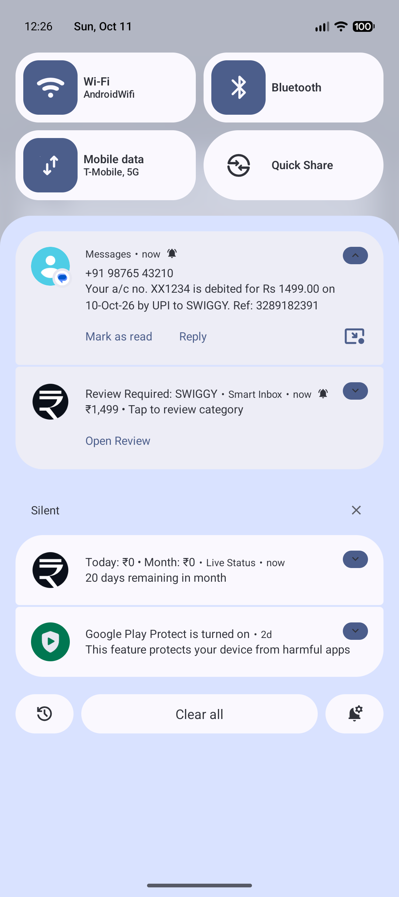
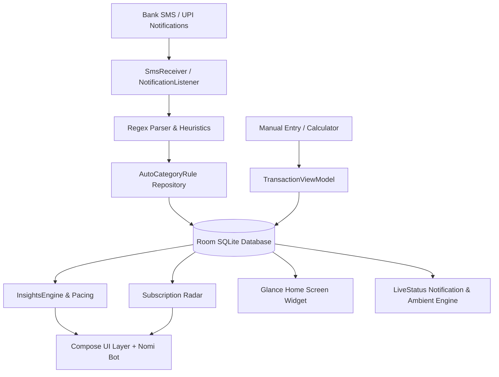

# SpendZen (MyExpenditureApp)

> **Local-First, Privacy-Preserving Intelligent Android Expenditure Tracker**  
> Automated bank SMS & UPI parsing, double-entry accounting precision with `BigDecimal`, hardware-accelerated AI mascot companion, micro-expenditure leak radar, and zero network telemetry.

<p align="center">
  <a href="docs/pitch_deck/index.html">
    
  </a>
  <a href="docs/pitch_deck/index.html">
    
  </a>
</p>

> [!TIP]
> 📽️ **Interactive Product Deck**: Open [`docs/pitch_deck/index.html`](docs/pitch_deck/index.html) in your browser for a standalone, animated 12-slide Keynote-style presentation featuring Nomi and the app's core flows.

---

## 📱 Google Play Store Showcase

| 1. Financial Command Center | 2. Instant Auto-Payment | 3. Deep Spend Analytics | 4. Meet Nomi: AI Guardian | 5. Widget & Ambient Alerts |
| :---: | :---: | :---: | :---: | :---: |
|  |  |  |  |  |
| *Live Budget Digest, Health Score & Safe Burn* | *Real-Time SMS Detection & 1-Tap Logging* | *Runway Forecasting & Micro-Leak Radar* | *Zero-Bloat Hardware-Accelerated Mascot* | *Home Screen Glance & Instant Notification Review* |

---

---

## 🤖 Meet "Nomi" — The Minimal Geometric Companion

<p align="center">
  
</p>

### 🎨 The Design Theme & Philosophy

**Nomi** was engineered as an antidote to generic cartoon finance mascots. Borrowing its soul from **Teenage Engineering**, **Nothing OS**, and **Grok Bot**, Nomi feels like a precision pocket synthesizer or high-end laboratory device:

- **Tactile Physicality**: Enclosed in a **Matte Obsidian Dark Titanium** squircle chassis (`#1E293B` → `#0F172A` → `#020617`) with a 45° diamond-cut metallic chamfer rim and a recessed high-contrast dark glass visor (`#080C14`).
- **Discreet Emotional Feedback**: Rather than nagging notifications or anxiety-inducing spreadsheets, Nomi conveys the status of your financial health through subtle geometric LED expressions.
- **Zero Overhead & 100% Privacy**: Built entirely with mathematical vector paths on Jetpack Compose `Canvas`. There are **0 KB of raster assets**, 0 network pings, and zero battery drain—running natively on the Android GPU shader pipeline at **120 FPS**.

---

### 🎭 The Emotional States Matrix

| Emotion State | Visual Signature | Color Spectrum | Meaning & Behavior Trigger |
| :--- | :--- | :--- | :--- |
| **`NEUTRAL`** | **Capsule Beams `\| \|`** | **Neon Cyan (`#38BDF8`)** | **Discreet Surveillance**: Default baseline state. Monitors real-time balance and incoming transaction flows with an organic 3.8s periodic eyelid blink. |
| **`ALERT`** | **Angled Slits `\ /`** | **Coral Crimson (`#F43F5E`)** | **Defensive Interception**: Triggers when daily burn rate exceeds safe baseline thresholds, budget envelopes hit 90%+, or unexpected leak surges occur. Vigilant, never shaming. |
| **`THRIVING / SAVING`** | **Smiling Arcs `^ ^`** | **Mint Emerald (`#10B981`)** | **Quiet Financial Optimism**: Appears when monthly net flow is strongly positive, budget pacing is well under limits, and savings goals hit key milestones. |
| **`SLEEPING`** | **Calm Dashes `- -` + Floating Z** | **Dim Soft Cyan (`#38BDF8` @ 55%)** | **Ambient Slumber**: Activates late at night (11:00 PM – 6:00 AM) or when the ledger is idle. Features a slow, deep 3.4s breathing rhythm and an animated floating `"Z"` particle drifting gently upward. |
| **`SCANNING`** | **Sweeping Laser `—·—`** | **Electric Indigo (`#818CF8`)** | **Edge Intelligence**: Real-time laser radar reticle that sweeps down the visor when bank SMS notifications or UPI payments are being parsed and categorized. |

---

### ⚡ Interactive Multi-Phase Boot Sequence

Tapping Nomi anywhere in the application awakens the full **Companion Console**, executing a choreographed 2-second boot animation before settling into live steady-state monitoring:
1. **Spring-Damped Chassis Expansion** (`0–450ms`): Physical chassis pops into view with natural spring physics (`DampingRatioMediumBouncy`).
2. **CRT Visor Vertical Expansion** (`0–400ms`): The high-contrast dark glass display unfolds vertically like classic Braun or cathode-ray displays.
3. **Lidar Radar Sweep** (`450–950ms`): A crisp horizontal laser sweep scans top-to-bottom across the visor to calibrate sensors.
4. **Curious Eye Glance & Playful Wink** (`950–1850ms`): The LED capsules glance left, glance right, and give a playful single-eye wink.
5. **Real-Time Financial Diagnostics**: Hands off seamlessly to live floating behavior, displaying your live **Financial Health Score (0–100)**, **Safe Daily Allowance**, and intelligent pacing advice.

---

## 📸 App Screens Gallery

### Primary App Screens
| 01. Dashboard | 02. Nomi Companion | 03. Analytics & Runway |
| :---: | :---: | :---: |
|  |  |  |

| 04. Transactions Feed | 05. Add / Edit Transaction | 06. Category & Subcategories | 07. Auto Payment Overlay |
| :---: | :---: | :---: | :---: |
|  |  |  |  |

### Glance Widget & Ambient Notifications
| 08. Jetpack Glance Home Screen Widget | 09. Smart Notification Center & Review Drawer |
| :---: | :---: |
|  |  |
| *Live Liquid Net, Safe Burn, 7-Day Sparkline & +Quick Add* | *Ambient Expenditure Ticker & 1-Tap SMS/UPI Review* |

---

## 🧩 Interactive Home Screen Widget (Jetpack Glance)

SpendZen features a responsive, dark glassmorphism Android home screen widget built with **Jetpack Glance 1.1** (`ExpenditureWidget`), giving you instant access to your financial pulse without opening the application:

<p align="center">
  
</p>

### Key Widget Capabilities:
- **Real-Time Health Status Pill**: Shows live AI diagnostic status badge (e.g. `● OPTIMAL • 85` in mint green or `● WARNING • 48` in amber gold) reflecting budget pace and liquid reserves.
- **1-Tap Glassy `+ Quick Add` Action**: Instant shortcut that directly invokes `MainActivity` with quick transaction intent parameters (`QuickAddKey to "quick_add"`), opening the expense bottom sheet with zero navigation latency.
- **Primary Balance Hero**: Prominently displays your aggregated **Net Liquid Balance** (e.g. `₹54,400`) alongside month-to-date **Net Flow** with dynamic green (`+`) or red (`-`) delta pills.
- **4-Metric Glass Bento Grid**:
  - `Today's Burn`: Today's outflow in real-time Indian Rupee format (`₹2,350`).
  - `Daily Avg`: Average daily burn rate across the month (`₹1,850/d`).
  - `Safe/d`: Safe daily allowance computed dynamically from remaining days and budget limits (`₹1,420/d`).
  - `Month Total`: Total cumulative outflow for the calendar month.
- **7-Day Outflow Trend Sparkline**: Proportional vertical micro-bars visualizing daily spend velocity over the past 7 days, highlighting today's bar with electric indigo accent and status indicators (`📬 Pending Reviews` or `📅 Bills Due`).
- **Micro-Leak Radar & Bill Alert Banner**: At-a-glance awareness of recurring low-value spending leaks (`₹1,440 (1% of spend)`) and upcoming subscription charges (`AWS Hosting in 2d`).
- **Glassmorphic Surface Design**: Custom XML vector drawables (`glance_glass_card_bg.xml`, `glance_glass_inner_box.xml`, `glance_glass_button_bg.xml`) with translucent dark gradients and 1dp subtle borders.

---

## 🔔 Ambient & Smart Notification System

SpendZen provides a zero-latency, privacy-preserving notification engine designed to keep you aware of your spending without cluttering your device:

<p align="center">
  
</p>

### Notification Channels Architecture:

| Channel ID | Channel Name | Importance | Description & Visual Treatment |
| :--- | :--- | :--- | :--- |
| `channel_live_status` | **Live Expenditure & Shortcuts** | `IMPORTANCE_LOW` *(Silent, Lockscreen Visible)* | Persistent ambient status bar ticker displaying today's burn, month total, remaining budget, days left in month, and **3 one-tap actionable shortcut chips**: `[+ Quick Add]`, `[📊 Analytics]`, and `[📥 Smart Inbox]`. |
| `channel_review` | **Transaction Review** | `IMPORTANCE_HIGH` *(Heads-up banner)* | Instantly triggered upon parsing an incoming bank SMS or UPI payment. Shows merchant name, formatted amount (e.g. `₹1,499`), category inference, and a direct `[Open Review]` action button. |
| `channel_budget` | **Budget Alerts** | `IMPORTANCE_DEFAULT` | Intelligent pacing alerts dispatched when spending in any category hits 80%, 90%, or 100% of defined monthly limits with coral red visual warning. |
| `channel_subscription` | **Subscription & Bill Reminders** | `IMPORTANCE_HIGH` | Timely reminders for recurring bills (Netflix, Spotify, rent, utilities) due today or within 3 days, with direct deep-link into the **Subscription Radar**. |
| `channel_daily` | **Daily Reflection** | `IMPORTANCE_DEFAULT` | Scheduled evening reflection at 9:00 PM summarizing today's total outflow vs monthly baseline to reinforce healthy financial mindfulness. |
| `channel_monthly` | **Monthly Summary** | `IMPORTANCE_DEFAULT` | Month-end financial victory alert celebrating net savings flow and budget discipline. |

### Background WorkManager Pipeline:
- **`DailyReflectionWorker`**: Enqueued via `PeriodicWorkRequestBuilder` (24h period, triggers at 21:00 daily).
- **`BudgetWorker`**: Background backup sweep every 4 hours to verify threshold pacing.
- **`SubscriptionWorker`**: 12-hour periodic check monitoring active subscriptions and due date proximity.
- **`LiveStatusWorker`**: 6-hour periodic rollover ensuring midnight spend counters reset seamlessly.

---

## ✨ Core Features & Functionality

### 1. Smart Finance Command Center & Digest
- **Financial Health Score (0–100)**: Evaluates runway, burn pace, and savings ratios.
- **Safe Daily Allowance**: Calculates how much you can safely spend today based on remaining days and monthly targets.
- **Today's Burn vs. Baseline**: Highlights anomalies in daily outflow.
- **Micro vs. Major Expenditure Split**: Distinguishes between routine micro-spends (< ₹250) and major capital expenditures (> ₹250).

### 2. Automated Capture & Instant Payment Overlay
- **Real-Time SMS & Notification Parsing**: Ingests bank alerts (SBI, HDFC, ICICI, Axis, Canara, etc.) and UPI apps (Google Pay, PhonePe, Paytm, CRED).
- **Floating Translucent Overlay (`TransactionOverlayActivity`)**:
  - Pops up immediately when a payment is detected.
  - Clean segmented control `[ Expense | Income | Transfer ]` in modern pill capsule styling.
  - Pre-fills merchant title, amount, and parsed SMS notes.
  - One-tap category selection and *"Always categorize vendor"* automated rules.

### 3. Two-Tier Hierarchical Categories & Subcategories
- Full two-tier hierarchy across parents and subcategories (e.g. `🍽️ Food & Dining > 🛒 Groceries`, `☕ Cafes`, `🍔 Restaurants`).
- Quick-select category suggestion chips.
- Modal bottom sheet with clean search and custom category creation.

### 4. Deep Spend Integrative Analytics Suite
- **Monthly Spending Curve Card**:
  - Smooth hardware-accelerated cubic bezier spline with mint-to-transparent area gradient glow.
  - Interactive tap-to-inspect scrubber with animated pulse dots for daily spend amounts.
  - Prominent **Peak Spend Badge** (`Peak: ₹15,000 (Day 5)`) identifying outlier expenditure spikes.
  - Safe daily allowance dashed baseline indicating healthy pacing thresholds.
- **Segmented Expense Category Donut**:
  - Thick multi-colored donut ring with animated sweep rotation.
  - Centered aggregate outflow hero (`TOTAL SPENT: ₹29,180`).
  - Interactive slice selection and category breakdown list with spend percentage badges (Housing 51%, Food 19%, Transport 11%, etc.) and 1-tap merchant drill-down.
- **Daily Cash Burn Runway & Solvency Trajectory**:
  - Depletion area chart tracking liquid reserves against daily cash burn velocity.
  - Tri-zone solvency status indicator (`Depleted <3m`, `Safe Buffer 3-6m`, `Fortress Solvency 6m+`).
  - Real-time runway buffer estimation (`1.9 Months (CAUTION)` or `Safe Buffer`).
- **5-Axis Micro-Leak Radar & Anomaly Scanner**:
  - Concentric pentagonal spiderweb radar chart evaluating 5 key vulnerability vectors: **Frequency**, **Impulse**, **Q-Commerce**, **Weekend Surge**, and **Recurring Leaks**.
  - Illuminated translucent green polygon with vertex dots and animated radial sweeps.
  - Computed **Leak Risk %** badge and automated AI financial advice diagnostics.

### 5. Nomi Geometric AI Mascot Companion
- **Pure Compose Canvas Vector Animat (0 KB Raster Bloat)**:
  - Matte Obsidian Dark Titanium body (`#1E293B` → `#0F172A` → `#020617`) with chamfered metallic titanium accent edges.
  - High-contrast recessed dark glass visor display with subtle top specular glass reflection.
  - Natural micro-floating bobbing movement (`±2.5dp`) and organic keyframed eyelid blinking.
- **5 Expressive Animated States**:
  - **`NEUTRAL`**: Minimalist vertical neon cyan LED capsules (`#38BDF8`) with periodic organic keyframed eye blinking every 3.8s.
  - **`OPTIMAL / THRIVING`**: Cheerful mint-green inverted-V arcs (`^ ^`) celebrating financial health and budget discipline.
  - **`ALERT`**: Focused, sharp angled slits (`\ /`) in coral red (`#F43F5E`) highlighting high burn or budget breaches.
  - **`SCANNING`**: Sweeping horizontal radar laser beam with central pulsing indigo dot for real-time calculation.
  - **`SLEEPING`**: Calm resting horizontal eye bars (`- -`) in dim soft cyan with slower, deeper breathing float and an animated floating `"Z"` particle drifting gently upward.
- **Interactive Multi-Phase Boot Sequence & Mood Selector**:
  - Tapping Nomi opens an interactive diagnostic overlay with a 2-second boot sequence (Chassis spring bounce → CRT visor expansion → Laser scan sweep → Glance left/right → Playful wink).
  - One-tap interactive mood selector chips (`[Thriving]`, `[Alert]`, `[Neutral]`, `[Sleeping]`) to preview and test all animated emotional states.

### 6. Multi-Account Accounting Ledger
- Double-entry accounting precision using `java.math.BigDecimal` (`RoundingMode.HALF_UP`).
- Supports Bank Accounts, Credit Cards, Cash Wallets, and Inter-Account Transfers.
- Tracks liquid reserves separately from locked savings targets.

### 7. Savings Targets & Reserve Pockets
- Define custom financial milestones (e.g., Japan Trip 2027, Emergency Fund).
- Real-time progress bars and automated deposit pacing.

### 8. Subscriptions & Upcoming Bills Radar
- Auto-detects recurring merchant charges (Netflix, Spotify, broadband, rent, utilities).
- Calendar countdown showing bills due within 7 days.

### 9. Interactive Jetpack Glance Home Screen Widget
- Responsive 2x2 to 5x4 widget with real-time balance, today's burn, 7-day sparkline bar chart, and 1-tap quick logging.

### 10. Smart Notification & Ambient Status System
- Persistent lockscreen expenditure ticker and high-priority SMS review alerts with instant classification action buttons.

---

## 🛠️ Architecture & Tech Stack


```mermaid
graph TD
    A[Bank SMS / UPI Notifications] --> B[SmsReceiver / NotificationListener]
    C[Manual Entry / Calculator] --> D[TransactionViewModel]
    B --> E[Regex Parser & Heuristics]
    E --> F[AutoCategoryRule Repository]
    F --> G[(Room SQLite Database)]
    D --> G
    G --> H[InsightsEngine & Pacing]
    G --> I[Subscription Radar]
    H --> J[Compose UI Layer + Nomi Bot]
    I --> J
    G --> K[Glance Home Screen Widget]
    G --> L[LiveStatus Notification & Ambient Engine]
```

| Layer | Technology | Details |
| :--- | :--- | :--- |
| **Language** | Kotlin 2.0+ | Coroutines, Flow, StateFlow |
| **UI Framework** | Jetpack Compose | Material 3, Navigation 3 Backstack, Page Route Transitions |
| **Character & Mascot** | Pure Compose `Canvas` | Hardware-accelerated GPU shaders, 0 KB image bloat |
| **Database** | Room SQLite 2.7+ | Custom TypeConverters for `BigDecimal`, automated migrations |
| **Background Processing**| Android WorkManager | Periodic budget evaluation, scheduled health recalculations |
| **Widgets** | Jetpack Glance 1.1 | Responsive home screen widget with atomic data updates |
| **Notifications** | Android NotificationManagerCompat | 6 specialized notification channels, BigTextStyle, action intents |
| **Design Language** | Obsidian Minimalist | Dark space (#0B1019), Electric Indigo (#4F46E5), Mint Green (#10B981) |

---

## 📁 Project Structure

```
MyExpenditureApp/
├── app/src/main/
│   ├── java/com/example/myexpenditureapp/
│   │   ├── data/                 # Room Database, DAOs, Entities, Seeders, BackupManager
│   │   ├── domain/               # SmartDigestModel, InsightsEngine, Domain Models
│   │   ├── notifications/        # NotificationListener, NotificationHelper, Workers
│   │   ├── overlay/              # TransactionOverlayActivity (Instant SMS payment dialog)
│   │   ├── sms/                  # SmsReceiver, Regex Parsers
│   │   ├── ui/
│   │   │   ├── component/        # GeometricMascotBot, NomiCompanionOverlay, CategorySelectionBottomSheet
│   │   │   ├── screen/           # AccountScreens, AnalyticsScreens, TransactionScreens, BudgetScreens
│   │   │   ├── theme/            # Obsidian color palette, typography, shapes
│   │   │   └── viewmodel/        # TransactionViewModel, BudgetViewModel, AnalyticsViewModel
│   │   └── widget/               # ExpenditureWidget (Jetpack Glance 1.1)
│   ├── res/                      # XML resources, drawables, glance glass backgrounds, app icons
│   └── AndroidManifest.xml
├── docs/
│   ├── play_store/               # High-resolution Google Play Store showcase screenshot cards (01 to 05)
│   │   ├── 01_financial_command_center.jpg
│   │   ├── 02_instant_autopayment.jpg
│   │   ├── 03_deep_spend_analytics.jpg
│   │   ├── 04_meet_nomi_ai_companion.jpg
│   │   └── 05_smart_widgets_notifications.jpg
│   ├── screenshots/              # Real application screenshots (01 to 09)
│   │   ├── 01_dashboard.png
│   │   ├── 02_nomi_companion.png
│   │   ├── 03_analytics.png
│   │   ├── 04_transactions.png
│   │   ├── 05_add_transaction.png
│   │   ├── 06_category_sheet.png
│   │   ├── 07_auto_payment_overlay.png
│   │   ├── 08_home_screen_widget.png
│   │   └── 09_notifications_shade.png
│   ├── assets/                   # Nomi mascot brand system & identity board
│   ├── ARCHITECTURE.md           # Deep dive architectural documentation
│   └── SECURITY_PRIVACY.md       # Local-only privacy guarantee & permissions model
├── build.gradle.kts
└── README.md
```

---

## 🚀 Build & Run

### Prerequisites
- **Android Studio Ladybug (2024.2.1)** or newer
- **JDK 17** or **JDK 21**
- **Android SDK API 35** (Compile), **API 26+** (Minimum)

### Commands

Run unit tests:
```bash
./gradlew testDebugUnitTest
```

Build debug APK:
```bash
./gradlew assembleDebug
```

Install directly onto connected device / emulator:
```bash
adb install -r app/build/outputs/apk/debug/app-debug.apk
```

---

## 🔒 Privacy Guarantee

SpendZen is **strictly local-first**:
* **No network permissions** requested in `AndroidManifest.xml` (`android.permission.INTERNET` is omitted).
* **SMS & notifications** are parsed on-device in memory and never leave your hardware.
* **Database backups** are stored locally via Android Storage Access Framework (SAF).

---

## 📄 License

This project is licensed under the [MIT License](LICENSE).
