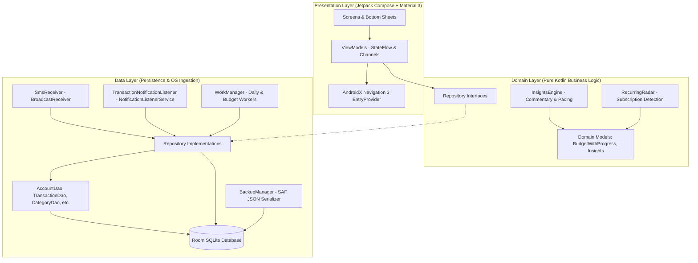
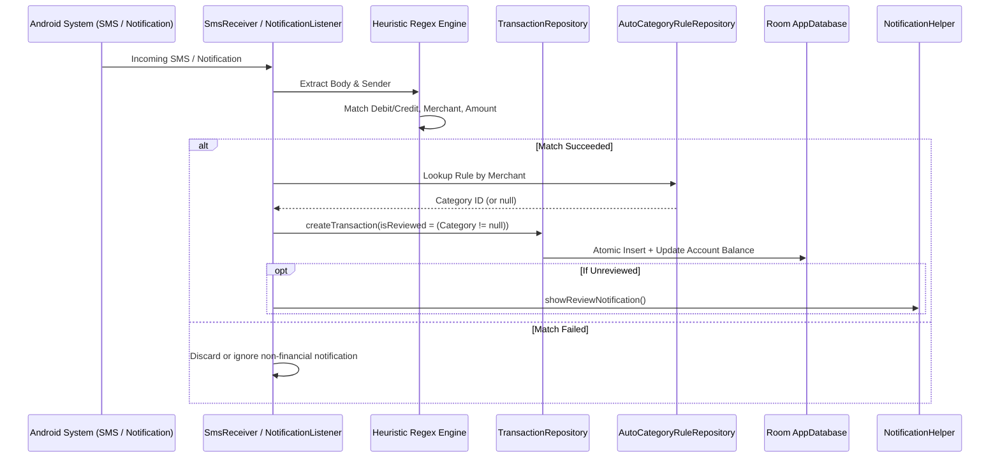
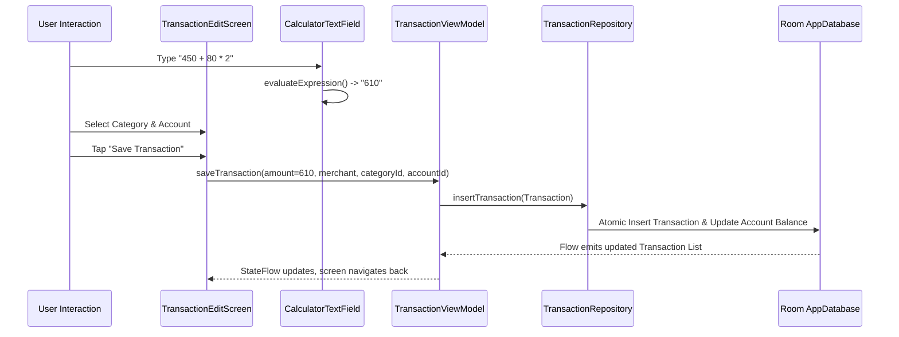

# 🏗️ System Architecture & Engineering Blueprint

## 1. Architectural Philosophy & Design Principles

**MyExpenditureApp** is architected around four non-negotiable engineering tenets:

1. **Local-First & Offline Resilience**: Zero dependence on remote servers. Full ACID database transactions via SQLite/Room.
2. **Double-Entry & Numerical Precision**: All currency math uses `java.math.BigDecimal` with explicit scale and `RoundingMode.HALF_UP` to prevent IEEE 754 floating-point truncation.
3. **Unidirectional Data Flow (UDF)**: Presentation layer consumes immutable `StateFlow` streams exposed by ViewModels, emitting user intents back to ViewModels.
4. **Ergonomic Material 3 Experience**: Native Compose styling using calm fintech palette tokens, tabular monospaced numbers, and responsive layouts.

---

## 2. High-Level Layered Architecture

The application implements Clean Architecture with strict separation of concerns across three core tiers:

---

## 3. Data Flow & Transaction Lifecycle

### A. Autonomous Ingestion Flow (SMS / UPI Notification)

### B. Manual Entry & Arithmetic Evaluation Flow

---

## 4. Module & Package Decomposition

### `com.example.myexpenditureapp`
- **`data/`**:
  - **`dao/`**: Room DAOs (`AccountDao`, `TransactionDao`, `CategoryDao`, `BudgetDao`, `AutoCategoryRuleDao`, `GoalDao`, `SubscriptionDao`).
  - **`entity/`**: Room SQLite table entities with foreign keys and indices.
  - **`repository/`**: Concrete implementations of domain repository interfaces.
  - **`backup/`**: `BackupManager` for lossless JSON schema serialization and SAF file I/O.
  - **`AppDatabase.kt`**: SQLite database definition and migration registry (`MIGRATION_1_2` through `MIGRATION_7_8`).
  - **`Graph.kt`**: Lightweight Service Locator providing singleton repository instances.
- **`domain/`**:
  - **`insights/`**: `InsightsEngine.kt` calculating burn rates, month-to-date net flows, pacing flags, and human commentary.
  - **`model/`**: Pure domain data models (`BudgetWithProgress`, `FinancialDigest`, `PacingStatus`).
  - **`repository/`**: Clean repository interfaces separating domain logic from SQLite implementation.
- **`notifications/`**:
  - **`NotificationHelper.kt`**: Notification channel registration, budget alerts, and WorkManager task scheduling.
  - **`TransactionNotificationListener.kt`**: Notification listener service capturing bank notification text.
- **`sms/`**:
  - **`SmsReceiver.kt`**: BroadcastReceiver listening for `android.provider.Telephony.SMS_RECEIVED`.
- **`ui/`**:
  - **`component/`**: Shared Compose UI components (`StandardTransactionRow`, `CategorySelectionBottomSheet`, `CalculatorTextField`, `DashboardPacedHeroCard`, `FinancialDigestCard`).
  - **`navigation/`**: Type-safe `Route` sealed hierarchy.
  - **`screen/`**: Composable screens (`AccountScreens`, `TransactionScreens`, `AnalyticsScreens`, `CategoryScreens`, `BudgetScreens`, `SettingsScreen`, `SubscriptionScreens`, `GoalScreens`).
  - **`theme/`**: Color tokens, Typography, Shapes, and dynamic Day/Night theme switcher.
  - **`viewmodel/`**: MVVM ViewModels exposing immutable `StateFlow` state.
- **`widget/`**:
  - **`ExpenditureWidget.kt`**: Jetpack Glance home screen widget.

---

## 5. State Management & Navigation Strategy

### Navigation 3 (AndroidX Navigation3)
The app adopts AndroidX Navigation 3 using `rememberNavBackStack(Route.AccountList)` and `NavDisplay`:
- **Adaptive Scene Strategy**: Uses `ListDetailSceneStrategy` for foldables and large tablets.
- **Top-Level Screen Guard**: Bottom navigation bar is rendered only on the four primary destinations (`AccountList`, `TransactionList`, `Analytics`, `Settings`) and automatically hidden during detail/form flows.

### ViewModels & StateFlow Lifecycle
- ViewModels expose read-only `StateFlow<UiState>` backed by private `MutableStateFlow`.
- Composables consume state via `collectAsStateWithLifecycle()` to automatically halt collection when in the background.
