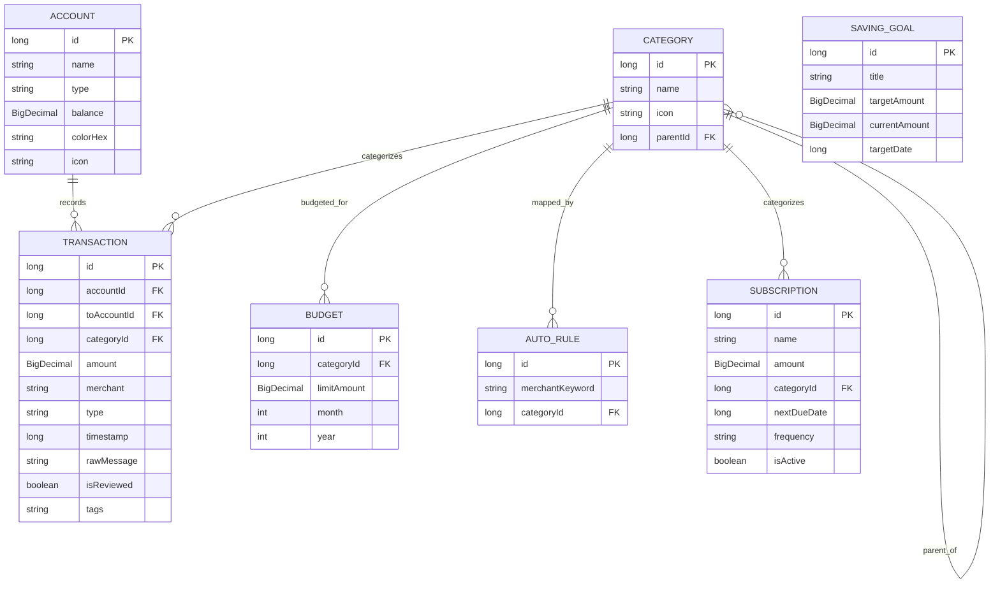

# 🗄️ Database Schema & Migration Specification

## 1. Relational Schema & Entity Relationships

The SQLite database is managed via Room 2.7+ with strict foreign key constraints and index optimizations:



---

## 2. Table Specifications

### 1. `accounts`
| Column | Type | Nullable | Description |
| :--- | :--- | :--- | :--- |
| `id` | `INTEGER` | `NO` (PK Auto) | Unique Account ID |
| `name` | `TEXT` | `NO` | Name (e.g. HDFC Salary, SBI Savings, Cash) |
| `type` | `TEXT` | `NO` | `"Bank"`, `"Credit Card"`, `"Cash"`, `"Wallet"` |
| `balance` | `TEXT` | `NO` | Stringified `BigDecimal` balance |
| `colorHex`| `TEXT` | `NO` | Primary theme color hex |
| `icon` | `TEXT` | `YES` | Emoji or Material icon identifier |

### 2. `transactions`
| Column | Type | Nullable | Description |
| :--- | :--- | :--- | :--- |
| `id` | `INTEGER` | `NO` (PK Auto) | Unique Transaction ID |
| `accountId` | `INTEGER` | `NO` (FK `accounts.id` CASCADE) | Originating Account |
| `toAccountId`| `INTEGER` | `YES` (FK `accounts.id` SET NULL) | Destination Account (for Transfers) |
| `categoryId` | `INTEGER` | `YES` (FK `categories.id` SET NULL) | Assigned Category |
| `amount` | `TEXT` | `NO` | Stringified `BigDecimal` amount |
| `merchant` | `TEXT` | `NO` | Vendor / Payee / Description |
| `type` | `TEXT` | `NO` | `"Expense"`, `"Income"`, `"Transfer"` |
| `timestamp` | `INTEGER` | `NO` | Epoch millisecond timestamp |
| `rawMessage` | `TEXT` | `YES` | Original SMS or Notification text payload |
| `isReviewed` | `INTEGER` | `NO` | Boolean flag (1 = Reviewed, 0 = Pending) |
| `tags` | `TEXT` | `NO` | Comma-separated or JSON list of labels (`#food`, `#split`) |

---

## 3. Database Migration Registry

Room migrations are declared explicitly in [`AppDatabase.kt`](file:///Users/amansaxena/AndroidStudioProjects/MyExpenditureApp/app/src/main/java/com/example/myexpenditureapp/data/AppDatabase.kt) without using destructive fallback migrations.

| Migration | Version Transition | Changes Applied |
| :--- | :--- | :--- |
| `MIGRATION_1_2` | 1 ➔ 2 | Added `rawMessage` and `isReviewed` columns to `transactions`. |
| `MIGRATION_2_3` | 2 ➔ 3 | Added `parentId` to `categories` for 2-tier parent/child hierarchy. |
| `MIGRATION_3_4` | 3 ➔ 4 | Created `auto_category_rules` table for keyword-based auto-categorization. |
| `MIGRATION_4_5` | 4 ➔ 5 | Added `tags` column to `transactions` for multi-label tagging. |
| `MIGRATION_5_6` | 5 ➔ 6 | Created `saving_goals` table for target-based savings tracking. |
| `MIGRATION_6_7` | 6 ➔ 7 | Added indices on `timestamp`, `accountId`, and `categoryId` for rapid query feeds. |
| `MIGRATION_7_8` | 7 ➔ 8 | Created `subscriptions` table for recurring bill radar & due date tracking. |

### Migration Policy:
1. **Never use `fallbackToDestructiveMigration()` in production builds.**
2. All migrations must be covered by automated unit tests validating table structure and data preservation across upgrades.
3. Use temporary table copy patterns (`CREATE TABLE _new`, `INSERT INTO _new SELECT`, `DROP TABLE`, `ALTER TABLE RENAME`) for SQLite column constraints.

---

## 4. Backup & Restore Schema Specification

The backup engine ([`BackupManager.kt`](file:///Users/amansaxena/AndroidStudioProjects/MyExpenditureApp/app/src/main/java/com/example/myexpenditureapp/data/backup/BackupManager.kt)) exports database tables into an atomic, version-stamped JSON payload:

```json
{
  "version": 8,
  "exportedAt": 1789839649000,
  "accounts": [ ... ],
  "categories": [ ... ],
  "transactions": [ ... ],
  "budgets": [ ... ],
  "autoCategoryRules": [ ... ],
  "savingGoals": [ ... ],
  "subscriptions": [ ... ]
}
```

* **Atomic Import**: Imports execute inside a single `db.runInTransaction { ... }` block. If any validation fails, the entire transaction is rolled back, preventing corrupted database states.
