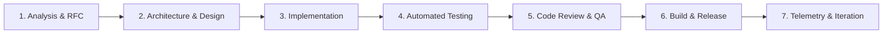
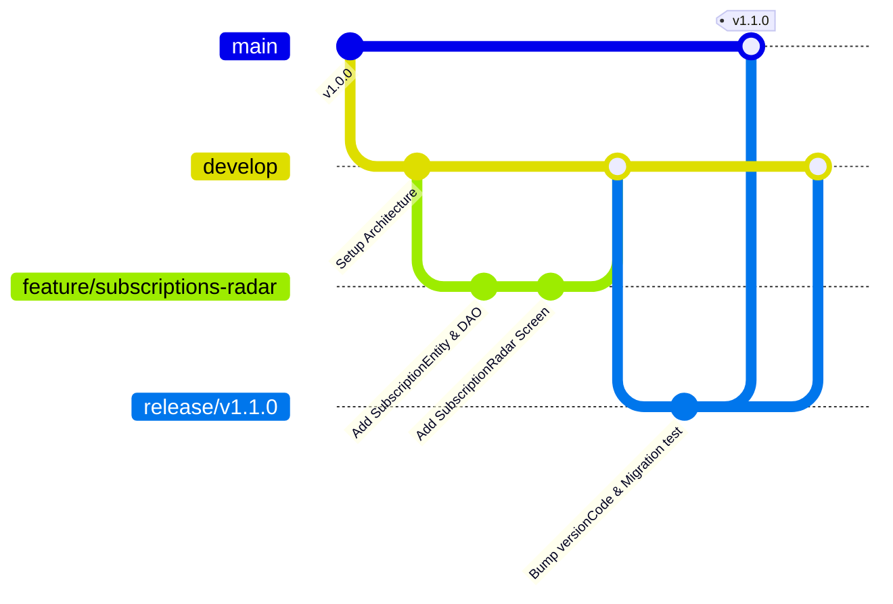

# 🔄 Software Development Lifecycle (SDLC) Specification

## 1. SDLC Phases & Operational Workflow

MyExpenditureApp adheres to a structured, quality-first software development lifecycle:



---

## 2. Detailed Phase Breakdown

### Phase 1: Requirements & RFC Specification
- **Feature Proposal**: Every non-trivial feature (e.g. Subscriptions Radar, New Migrations, Glance Widget) begins with a Request for Comments (RFC) document outlining:
  - User problem statement & workflow impact.
  - Mathematical correctness impact (`BigDecimal` ledger changes).
  - UI/UX ergonomic alignment with Material 3 design system.
- **Approval Gate**: Review and sign-off on design specs before writing implementation code.

### Phase 2: Architectural & Schema Design
- **Room Migration Planning**: If SQLite entities are modified, author explicit non-destructive `Migration(start, end)` definitions before touching DAOs.
- **Component Decomposition**: Plan reusable Composables with explicit stateless parameter contracts and state hoisting.

### Phase 3: Implementation & Coding Standards
- **Kotlin 2.0+ Idioms**: Exploit `sealed interfaces`, `value class`, explicit immutability (`val`), and coroutines structured concurrency.
- **Double-Entry Accuracy**: Mandatory usage of `BigDecimal` with `RoundingMode.HALF_UP` for all currency math. Never use `Float` or `Double` for financial values.
- **Compose Recomposition Hygiene**:
  - Pass stable lambdas and immutable data structures.
  - Use `key` identifiers in `LazyColumn` / `LazyRow` items to prevent unnecessary item recreations.
  - Observe permissions and external state with `DisposableEffect(lifecycleOwner)` on `ON_RESUME`.

### Phase 4: Automated Testing & Verification
- **Unit Testing**: Run `./gradlew testDebugUnitTest` prior to every commit.
- **Required Test Coverage**:
  - **Domain Logic**: 100% coverage on `InsightsEngine`, `evaluateExpression`, and financial projections.
  - **Data Layer**: Migration validation and `BackupSerializationTest` to guarantee zero data loss.
  - **Parsers**: Heuristic regex testing across diverse bank SMS templates.

### Phase 5: Code Review & Quality Gates
- **Peer Review Checklist**:
  - [ ] Does any new UI introduce "AI slop" or inconsistent border radii?
  - [ ] Are currency amounts formatted using tabular monospaced numbers?
  - [ ] Are touch targets at least 48dp on actionable controls?
  - [ ] Are all database operations non-destructive and transactional?
  - [ ] Does `./gradlew assembleDebug` build with 0 compilation errors?

### Phase 6: Build & Versioned Release
- **Semantic Versioning**: Releases follow `MAJOR.MINOR.PATCH` format:
  - `MAJOR`: Breaking database schema rework requiring migration bridges or major UI overhaul.
  - `MINOR`: New features (e.g. Subscriptions Radar, new Analytics charts).
  - `PATCH`: Bug fixes, parser heuristic updates, UI polish.
- **Build Command**:
  ```bash
  ./gradlew assembleRelease
  ```

---

## 3. Git Workflow & Branching Strategy



### Branch Conventions
* `main`: Production-ready code matching active stable releases.
* `develop`: Integration branch for tested feature branches.
* `feature/<feature-name>`: Scoped feature development branches.
* `fix/<bug-description>`: Targeted bug fixes.
* `release/vX.Y.Z`: Release preparation and migration validation.
