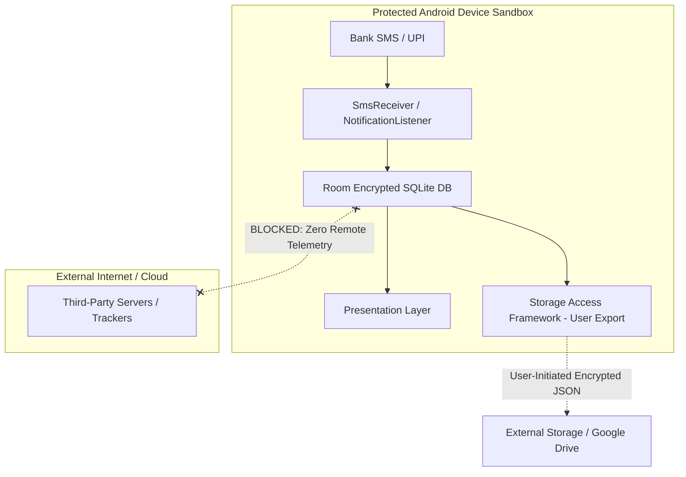

# Security Model & Privacy Architecture

## 1. Local-First & Zero-Knowledge Philosophy

**SpendZen** operates under a strict **Zero-Knowledge, Zero-Telemetry** privacy model:

1. **No External Network Calls**: The app does not transmit financial data, account numbers, merchant names, or device identifiers to any remote server or analytics platform.
2. **Local Sandbox Isolation**: SQLite database files (`expenditure_db`) reside strictly within Android's internal app sandbox (`/data/data/com.example.myexpenditureapp/databases/`), protected by Linux user ID process isolation.
3. **No Third-Party Trackers**: Zero advertising SDKs, crashlytics reporting, or marketing telemetry libraries are embedded in the APK.

---

## 2. Permission Containment & Least Privilege

The app declares only the strictly necessary Android OS permissions:

| Permission | Scope | Security Containment |
| :--- | :--- | :--- |
| `android.permission.RECEIVE_SMS` | Runtime Permission | Used solely inside `SmsReceiver` to parse incoming bank debit/credit alerts. Body text is discarded immediately after regex matching. |
| `android.permission.READ_SMS` | Runtime Permission | Used to backfill and ingest historical bank transactions with explicit user consent. |
| `android.permission.BIND_NOTIFICATION_LISTENER_SERVICE` | Explicit System Setting | Captures UPI push notifications (Google Pay, PhonePe, Paytm, CRED). Non-financial notifications are dropped immediately. |
| `android.permission.POST_NOTIFICATIONS` | Runtime Permission (API 33+) | Sends local-only transaction review alerts, budget limit warnings, and daily reflections. |

---

## 3. Data Ingestion & Sanitization

1. **Regex Heuristic Isolation**:
   - The regex parser only extracts: `amount`, `merchant`, `accountLast4Digits`, and `transactionType`.
   - Sensitive personal information, account passwords, OTPs (One-Time Passwords), and debit card PINs are discarded and never written to disk.
2. **Review Inbox Isolation**:
   - Automated transactions that cannot be confidently matched to an established category are flagged as `isReviewed = false` and routed to the Smart Review Inbox for explicit user approval.

---

## 4. Backup & Storage Access Framework (SAF)

- Backups are generated using Android's native Storage Access Framework (`Intent.ACTION_CREATE_DOCUMENT` / `Intent.ACTION_OPEN_DOCUMENT`).
- The app never requests broad storage access permissions (`READ_EXTERNAL_STORAGE` / `MANAGE_EXTERNAL_STORAGE`).
- File URIs are accessed with transient scoped permissions (`FLAG_GRANT_READ_URI_PERMISSION`, `FLAG_GRANT_WRITE_URI_PERMISSION`).
